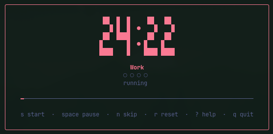
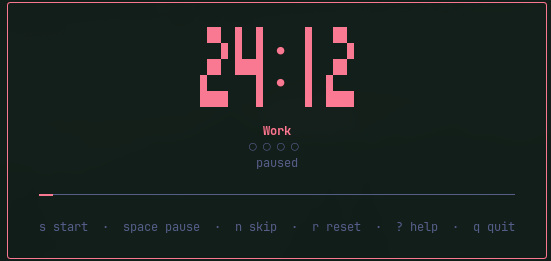
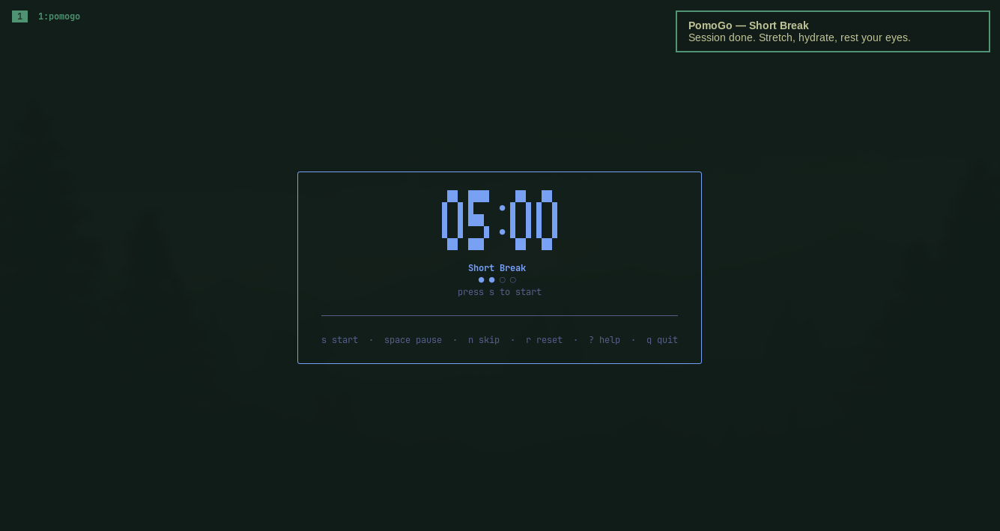
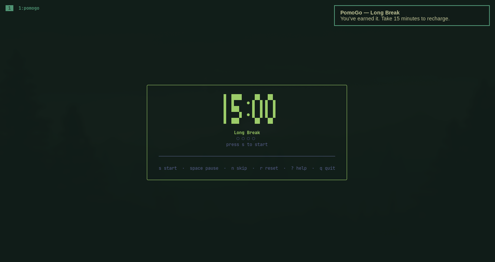
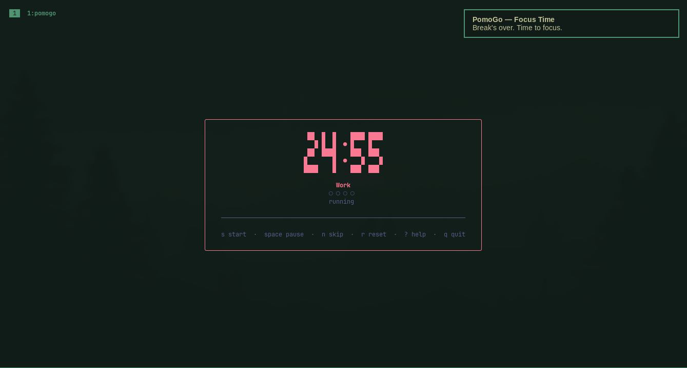

# PomoGo

A keyboard-driven Pomodoro timer for Linux terminals.

Single binary. No daemon. No config required to start.

<p>
  
  
</p>

## Install

```sh
go install github.com/Ibnu-Afdel/pomogo/cmd/pomogo@latest
```

Or grab a pre-built binary from the [Releases](https://github.com/Ibnu-Afdel/pomogo/releases) page.

Build from source:

```sh
git clone https://github.com/Ibnu-Afdel/pomogo
cd pomogo
go build -o pomogo ./cmd/pomogo
```

## Usage

```sh
pomogo              # start the timer
pomogo config init  # write a default config file
pomogo version
```

### Keys

| Key | Action |
|---|---|
| `s` | Start the queued session |
| `space` | Pause / resume |
| `n` | Skip to next phase |
| `r` | Reset |
| `?` | Help overlay |
| `q` / `ctrl+c` | Quit |

If PomoGo closes mid-session, it offers a one-key restore prompt on next launch.

## Configuration

Works out of the box. To create an editable config:

```sh
pomogo config init
# writes ~/.config/pomogo/config.toml
```

```toml
work_duration = 25
short_break_duration = 5
long_break_duration = 15
sessions_before_long_break = 4

theme = "tokyo-night"   # tokyo-night | catppuccin | gruvbox

notifications_enabled = true
sound_enabled = true
```

## Notifications & Sound

Notifications use `notify-send` — works with Mako, dunst, and any XDG-compliant daemon.
Sound plays via `canberra-gtk-play` (available on most GTK-based desktops and Wayland compositors that ship libcanberra). Both degrade silently if the tool is absent.

`notifications_enabled` and `sound_enabled` are independent toggles.

<p>
  
  
  
</p>

## Development

```sh
go test ./...
golangci-lint run
go build -o pomogo ./cmd/pomogo
```
